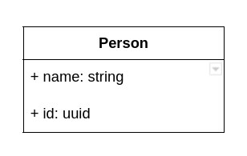

# API Documentation

## UML Diagram



The class diagram above shows the properties that are available on the `Person` resource.

## Base URL

The base URL for this API is: https://hngx-stage-two-task-sunny.onrender.com

## API Endpoints

**List of available endpoints**:

- POST `/api` - Create a person
- GET `/api` - Get all persons
- GET `/api/{id}` - Get a single person
- PUT `/api/{id}` - Update person
- DELETE `/api/{id}` - Delete person

## Create a Person (POST `/api`)

In Postman, you can create a new request for creating a person.

Request:

- Method: POST
- URL: `https://hngx-stage-two-task-sunny.onrender.com/api`
- Headers: `Content-Type: application/json`
- Body (raw JSON):

  ```json
  {
    "name": "John Doe"
  }
  ```

Response:

```json
{
  "data": {
    "name": "John Doe",
    "id": "f77f24cf-d3b8-4c9d-9d5f-6562b5329607"
  },
  "success": true,
  "message": "Successfully Created Person",
  "statusCode": 201
}
```

## **Get All Persons (GET `/api`)**

Create a request to retrieve all persons:

Request:

- Method: GET
- URL: `https://hngx-stage-two-task-sunny.onrender.com/api`

Response:

```json
{
  "data": [
    {
      "id": "f77f24cf-d3b8-4c9d-9d5f-6562b5329607",
      "name": "John Doe"
    }
  ],
  "success": true,
  "message": "Persons successfully found",
  "statusCode": 200
}
```

## **Get Person (GET `/api/{id}`)**

Create a request to retrieve a specific person by their ID or name:

Request (using `id` or `name`):

- Method: GET
- URL: `https://hngx-stage-two-task-sunny.onrender.com/api/1` (replace `1` with the actual ID)

Response:

```json
{
  "data": {
    "id": "f77f24cf-d3b8-4c9d-9d5f-6562b5329607",
    "name": "John Doe"
  },
  "success": true,
  "message": "Person successfully found",
  "statusCode": 200
}
```

## **Update Person (PUT `/api/{id}`)**

Request:

- Method: PUT
- URL: `https://hngx-stage-two-task-sunny.onrender.com/api/1` (replace `1` with the actual ID or the person's name)

  ```json
  {
    "name": "Jenny Smith"
  }
  ```

Response:

```json
{
  "data": {
    "name": "Jenny Smith",
    "id": "f77f24cf-d3b8-4c9d-9d5f-6562b5329607"
  },
  "success": true,
  "message": "Successfully Updated Person",
  "statusCode": 200
}
```

## **Delete Person (DELETE `/api/{id}`)**

Create a request to delete a person by their ID or name:

Request:

- Method: DELETE
- URL: `https://hngx-stage-two-task-sunny.onrender.com/api/{id}` (replace `1` with the actual ID or name)

Response:

```json
{
  "data": 1,
  "success": true,
  "message": "Successfully deleted Person",
  "statusCode": 200
}
```
